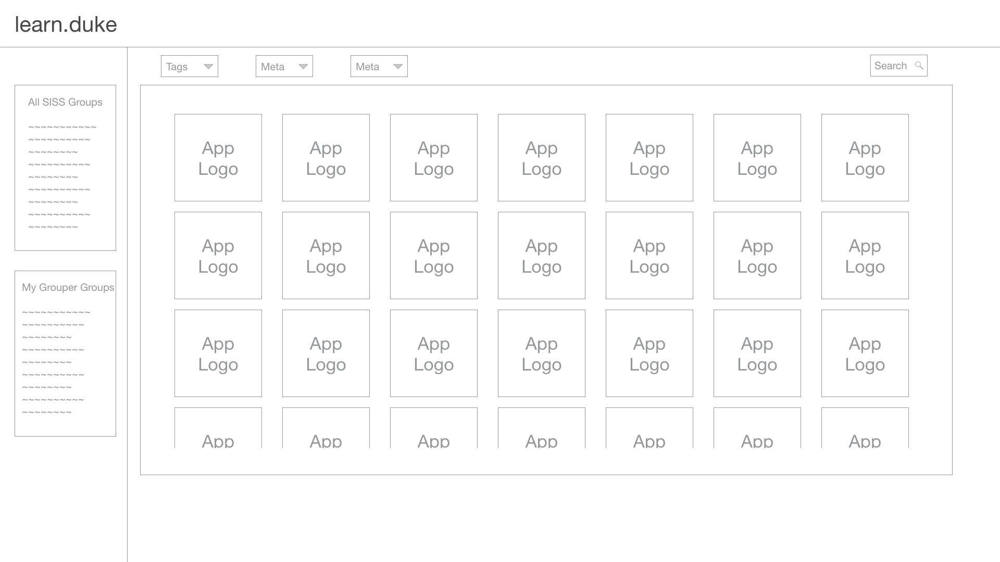
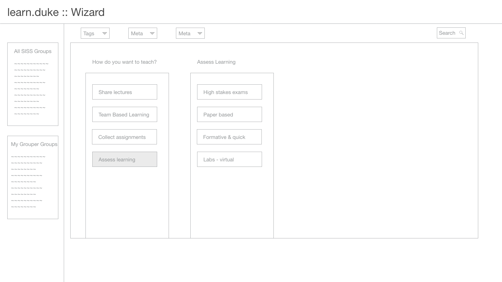

# learn.duke.edu

## Table of Contents
1. [Scope](#scope)
1. [Assumptions & hypothesis](#assumptions-&-hypothesis)
1. [Components](#components)
	1. [courses](#courses)
	1. [apps](#apps)
	1. [packages & templates](#packages-&-templates)
	1. [wizard](#wizard)
	1. [content creation](#content-creation)
	1. [cms](#cms)
1. [Next steps](#next-steps)

learn.duke.edu will provide the following to the Duke community.

* Cataloged and searchable platform of learning technologies available at Duke.
* Provide a single place for faculty to provision groups, technologies, and integrations for their courses.
* Suggest tool packages, or standard sets of tool combinations, to help faculty accomplish their learning objectives.
* Provide a single place for students to see the classes they are in, what tools those classes are using, and what they should do next for those classes.
* Solicit suggestions for new tools Duke should support, then Duke can research support, automation and provisioning behind the new tools. 
* Provide information on learning technology management and policies. 
	* LearnTAC
	* process for how tools get added
	* minimum requirements from LTS, ITSO, Procurement, etc
* Audiences and potential benefit:
	* Students: Have all apps together, one stop shop. Place to suggest new tools.
	* Faculty: single place with tools together to easily provision for a course. Select pre-packaged groups of tools commonly used. Suggest new tools they like. 
	* Admins: get data of which tools are used most, and suggestions of new tools by faculty/students that Duke can research adopting/licensing. 

# Scope

* The scope of learn.duke is on courses at this time
* Technologies must be learning related, but are not limited to enterprise licensed. School, departmental, and unlicensed tools will also be listed
* learn.duke will be an open source licensed project

# Assumptions & hypothesis
* We hear a lot about the the cognitive load that taking 5 courses taught 5 different ways on 5 different tech stacks has on students, does this affect that positively?
* learn.duke should help clarify the LMS's role in the future

> Faculty aren’t always risk takers, ‘coursera might not be around next year, so what will be here that I get guaranteed returns out of’. --Mine
* Will faculty be receptive to change when the output is their content, easily accessible and maneuverable for the future?

* Is there an opportunity for inter-institutional collaboration here?

* At the future of online at duke panel, there was  talk about networked communities of learners. Does that have a place here or is this the thing that connects you to your communities quicker/easier?
Maybe part of the UI is linking to the community that gets created for every course? Every course gets a slack channel?

---
# Components

## courses
learn.duke could act similarly to the Canvas landing page, as a dashboard that can send users to whatever server their learning experience lives on.

Now, users can access sakai, extend, sites@duke, people.duke, whatever course sites from the same place.

### courses = groups
Adding a new learning experience starts with the group selection.

groups come from groupmanager.oit API to learn.duke

### Tasks done at courses
* create course cards/sites
* manage course memberships including add TAs and guests to the reference groups like you do on Toolkits.
* complete the instructional tasks like create assignment once tools are enabled

### Questions for courses
* What happens with cross-listed courses? Is there a master group that's created?

## apps
A new service that contains a database of all learning technologies around the university.

* All apps and their apis
* presented via API to learn.duke or does it have it's own UI?

An app store UI built that allows searching/filtering for apps and has grouper group awareness.

A new interface for selecting and managing these apps in Sakai, indicated here by the + button on the left navigation. This overrules site info::manage tools

This calls the app store, but the UI is changed slightly as the interface knows it's inside Sakai via LTI and already knows what what group context we're in.

This should be applied to all platforms, wordpress, drupal, open edx, sakai.

### Tasks done at apps
* turn on the tools
* configure tools
* basic add url of specific tool or block for things not in the ecosystem
* usage metrics
* discipline specific app management

### Questions on apps
* none entered at this time

## packages & templates

Several creation interfaces will be tested and built to accommodate the spectrum of users.

Shown here, pre-built templates that select tools based upon group context or other criteria.

### Tasks done at packages & templates
* none entered at this time

### Questions on packages & templates
* none entered at this time

## wizard
Shown here, a three step wizard that walks users through ways of teaching and what tools are offered.

### Tasks done at wizard
* none entered at this time

### Questions on wizard
* none entered at this time

## content creation

A new way to create learning content, it is the evolution of the syllabus. It competes not against the LMS, but against the word doc.

> Making the UX feel effortless is really, really hard, but is the point. It's what makes it next gen.

> Remember, users don't want to use your app, they want to be done using your app. Faculty don't want students to watch a video, watching a video isn't learning. They want to have tomorrow's in class discussion about the meaning of the video.

An opposing model to apps, templates, and wizard, content creation focuses on just in time provisioning of a tool (LTI, CI, or API). Don't make a faculty click add warpwire, configure warpwire. Show them an add video button and when they click it, add and configure warpwire for their course in the time it takes the textbox to appear so they can either paste their youtube URL in or click the Warpwire icon. 

There is no site info::manage tools. There is only create course content

Inspired by Wordpress Gutenberg, content will be managed by the block. There will be standard text and web blocks that furl and unfurl content.

But there will also be content item blocks for all IMS Content Item integrations.

### Evolve the syllabus
1. ingest .docx syllabus
2. convert to web format
3. run course
4. export .docx 

### Integrate with apps
1. upload syllabus
2. scan 4 keywords
3. suggest tech w/ found options
4. convert docx to md and web
5. find resources for eReserves and add links to them

### Course content with an open-first mindset
Sharing doesn't have to mean exposing your students and the safe spaces we create for them to assess and discuss their learning. Consumer apps have solved this.

* export content to social networks
* export calendar
* export to sites@duke
* export to medium

### Tasks done at content creation
* none entered at this time

### Questions on content creation
> MS Word vs Google docs. The paradigm shift was about people. Real time collaboration vs single user document creation.

What is the paradigm shift from the status quo to this?

## CMS

### Tasks done at cms
* suggest an app be added to appdb
* learnTAC info
* policies on how learning technologies are managed
* blog
* * learnplatform like community around apps (profmikegreene not sure about this one)

### Questions on cms
* none entered at this time

---

# Next steps

Give us something to test with her students, other faculty, and Duke community and build the narratives around how to communicate these ideas.

- [ ] create a courses mockup using Negotiation DLX module
- [ ] create a content creation mockup using Negotiation DLX module

