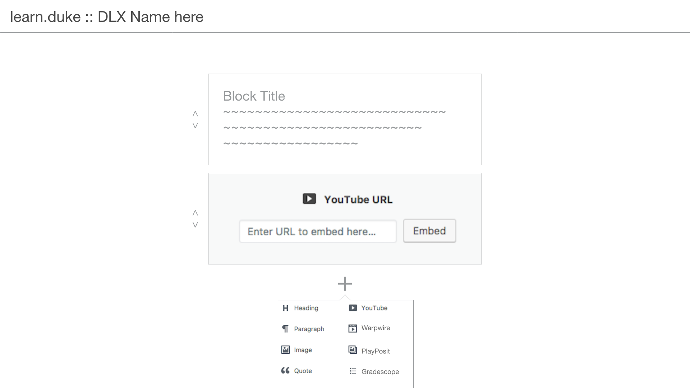

# content creation

A new way to create learning content, it is the evolution of the syllabus. It competes not against the LMS, but against the word doc.

> Making the UX feel effortless is really, really hard, but is the point. It's what makes it next gen.

> Remember, users don't want to use your app, they want to be done using your app. Faculty don't want students to watch a video, watching a video isn't learning. They want to have tomorrow's in class discussion about the meaning of the video.

An opposing model to apps, templates, and wizard, content creation focuses on just in time provisioning of a tool (LTI, CI, or API). Don't make a faculty click add warpwire, configure warpwire. Show them an add video button and when they click it, add and configure warpwire for their course in the time it takes the textbox to appear so they can either paste their youtube URL in or click the Warpwire icon. 

There is no site info::manage tools. There is only create course content

Inspired by Wordpress Gutenberg, content will be managed by the block. There will be standard text and web blocks that furl and unfurl content.

But there will also be content item blocks for all IMS Content Item integrations.

## Evolve the syllabus
1. ingest .docx syllabus
2. convert to web format
3. run course
4. export .docx 

## Integrate with apps
1. upload syllabus
2. scan 4 keywords
3. suggest tech w/ found options
4. convert docx to md and web
5. find resources for eReserves and add links to them

## Course content with an open-first mindset
Sharing doesn't have to mean exposing your students and the safe spaces we create for them to assess and discuss their learning. Consumer apps have solved this.

* export content to social networks
* export calendar
* export to sites@duke
* export to medium

Content created on the platform is abstracted from the course specific metadata making it more sharable.

## User stories
* none entered at this time

## Questions on content creation
> MS Word vs Google docs. The paradigm shift was about people. Real time collaboration vs single user document creation.

* What is the paradigm shift from the status quo to this?

* Should this be a git-backed learning object repository of some kind? Or feed into it at least?

### 1/4/18 meeting with MG/JJ
* start rolling the syllabus repository/builder into learn.duke early. Don't start /content-creation with the entire course, that's too big a task
* the syllabus builder is a tool that has to be built
	* we need a new syllabus tool in Sakai anyway so…
* having the syllabus builder early in the iterations allows us to piggy back our sakai.tool integration with /content-creation /apps/.tool integration
* have the syllabus builder also allows us to pilot the idea of having something other than the LMS as the real course hub, reliant on the LMS for lots of things, just not as the hub.

Faculty workflow
1. create .docx syllabus
2. upload (MVP1 does nothing but file passthrough, gives us the syllabi to begin analyzing without impacting users)
3. learn.duke runs machine learning on syllabi to begin understanding the components and how they will interact with other tools
4. abstract out the components
5. run machine learning on those components to recommend tools

We should be able to UX test the above workflow with faculty quite well without a lot of investment.
