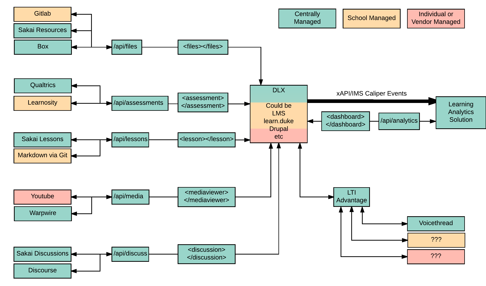

# Designed learning experience
Users use a wide variety of tools in their everyday life, the tools update regularly, the users switch between them regularly.

Users want this agency in their learning experience. They want intuitive variety of their choosing.

This doesn't mean the LMS goes away, it does shift priorities away from it.

This doesn't mean we focus on making things 'prettier', it does mean we focus on the whole teaching and learning experience.

The smart phone is a good metaphor. Users are provided a default set of apps, like Safari, that represent the starting point, not the majority of functionality the phone is capable of.

They are also presented with an app store containing varied means of introducing new functionality and apps, like Chrome and Firefox, to them.

App developers use Application Programming Interfaces or APIs to bridge the gap between their ideas and users. APIs give developers the power to do almost anything

The learning technology ecosystem will contain all the pieces of this metaphor. 

* default apps (like the LMS or Box)
* app store (curated lists of approved or supported apps)
* app developers (both in and outside the university)
* APIs (connection points for users and app developers to customize their experience)

This results in a very specifically designed user experience the first time each user picks up a new phone and tremendous agency to customize that experience to meet their needs.

Provide students with a singular designed learning experience that pulls in the data from all tools connected to a course and streamlines the presentation of what to do next into something like Coursera or edX

> Design is solving a problem. Many things have to be designed before you approach the field of visual design and decide how things look.

The ecosystem is a shift in priority from administration of courses to designed experiences for teachers and learners.

This doesn't mean the LMS goes away
This doesn't mean things are 'prettier'

This means we, the stewards of the ecosystem, consider the whole experience of what it means to offer learning and to receive learning at Duke.

The learning technology ecosystem would provide intuitive, designed experiences for teachers and learners to do the following.

# Elements
## Assessment
* rubrics
* outcomes
* assignments
* ePortfolios
* credentials
* badges
* classroom response

## Authoring
* lessons
* learning pathways
* web hosting

## Communication
* web conferencing
* discussions

## Computing
* labs
* laptops
* devices
* research computing resources

## Learning Management
* gradebook
* groups
	* rosters	
* experience progression
* calendar

## Media
* media management
* lecture capture
* production

## Storage
* file management
* eText
* restricted resources

## Capabilities
Services and experiences have the ability to:

* Batchable - select multiple, perform action
* Groupable - connect to groups of users
* Gradeable - assign value
* Adaptable - be part of a pathway
* Collaboratable - users interact simultaneously
* Annotatable - allow feedback and context
* Openable - extended to outside groups
* Programmable - have APIs
* Trackable - create events for analytics
* AIable - can attach intelligence

## An Example
Let's walk through an example faculty experience with some of the current technologies used to accomplish them.

1. View the courses they are teaching this semester (DukeHub)
2. View the details and roster for a single course (DukeHub)
3. Build a syllabus for the course (Word)
4. Store the syllabus somewhere accessible to the roster (Sakai, Box, Email)
5. Build content and activities to support the goals described in the syllabus (Word, Sakai, Class discussion, lecture *sigh*)
6. Build assessments to evaluate how well the content supports those goals (Sakai, Clickers, Scantron, PebblePad)
7. Grade assessments and provide feedback (Red ink pen, Sakai, Word)

Level 1 - 

Level 2 - 

Level 3 - 

Level 4 - configurable experience that gives faculty choice

Today, most faculty are somewhere between links on a departmental webpage out to the various steps and app with a Duke header bar that embeds each step into the page, i.e. the LMS. 

Coursera is a move in the right direction in that it's a single interface for program and course management, teaching, learning, and credentialing. But the experience is limited to what they define.

A single, designed experience that requires each step to be done inside of the design it dictates ecosystem model would reduce the switching costs of moving between tools and user interfaces.  

A level 4 ecosystem doesn't care what system faculty use to store a syllabus, it offers a single interface to create stuff, upload stuff, and store stuff. 

If faculty want to use Box instead of Sakai Resources, it's just a checkbox in a setting somewhere, not a completely different experience.  

Instead of having to think where do I upload this file to, faculty just upload the file to the desired default location they've chosen.

## User stories
* none entered at this time

## Questions on DLX
* none entered at this time

